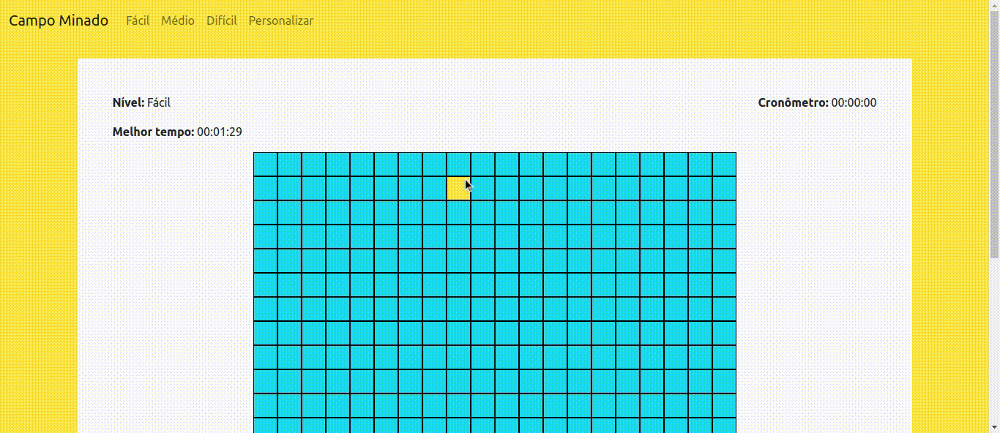

# Campo Minado

Campo minado desenvolvido em JavaScript com objetivo de estudos na linguagem. 

### Regras

- Cada quadrado pode ser revelado clicando sobre ele com o **botão esquerdo** do mouse e, caso o quadrado clicado contenha uma mina, o jogo acaba.

- Os quadrados que não contiverem minas, conterá a quantidade de quadrados adjacentes que possuem minas. 

- Se clicar em um quadrado em que ao redor não hover nenhuma mina, todos os quadrados adjacentes que não possuem minas em em volta são abertos em cascata, isto é, até que um quadrado que possui minas ao redor seja atingido.

- O jogador pode marcar qualquer quadrado que acredita ter uma mina com uma bandeira, basta clicar sobre ele com o **botão direito** do mouse. Caso clique novamente com o **botão direito**, o quadrado será desmarcado.

- O jogo é ganho quando todos os quadrados que não contém minas são revelados. 

### Observações

- Para o desenvolvimento do sistema foi utiliado o framework Bootstrap v5.0. Versões posteriores ou anteriores podem provocar alterações no *layout* do sistema.
